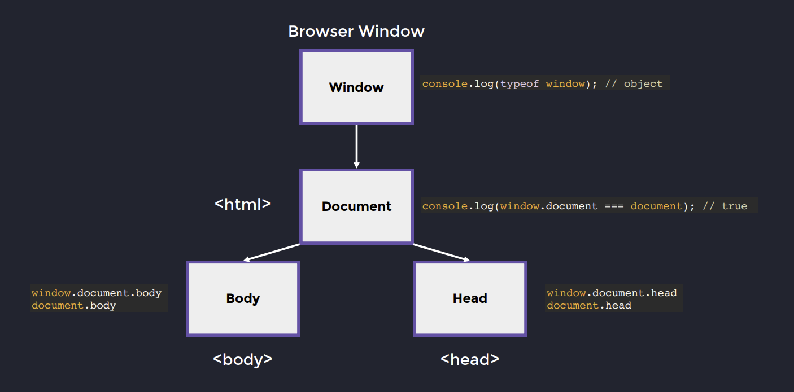
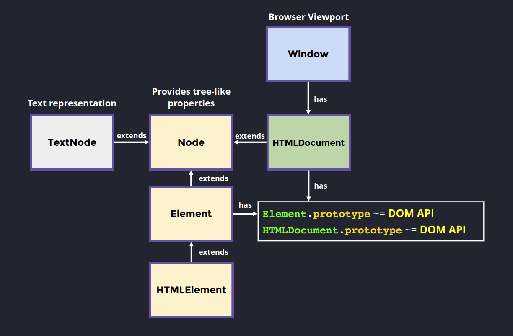

# 2 - DOM API

## 2.1 - DOM & Querying

The DOM API is the `interface with tools to manipulate the page`. It is exposed through a `hierarchy of browser objects`, not just HTML elements.

### Global entry points

The browser exposes two main ob- `windo- window → global execution context

- document → representation of the current page



Window is not part of the DOM tree.

It:

- Represents the browser environment (not just viewport)
- Holds global APIs (timers, events, etc.)
- Contains document

Important:

> window does not provide DOM manipulation directly. It only exposes document, which is the entry point to the DOM.

### Where the DOM API actually lives

The DOM API is not attached to a single place.

Instead, `it is distributed across the prototype chain`:

- Element.prototype → element-specific APIs (querySelector, attributes, etc.)
- Document.prototype → document-specific APIs (createElement, querySelector)
- Node.prototype → tree traversal (parentNode, childNodes)
- EventTarget.prototype → events (addEventListener)

The reasoin is that API must work across different node types:

-HTML elements
-SVG elements
-Document
-Text nodes (partially)

Cause → effect:

APIs are split by responsibility (tree, elements, document, events)
Prototype chain composes the full behavior



### Core hierarchy

The DOM is built on a class hierarchy that represents a tree structure.

Simplified structure:

- Node
  - Element
    - HTMLElement
  - TextNode

Behavior:

- Node → provides tree structure (parent, children, traversal)
- Element → adds DOM manipulation capabilities
- HTMLElement → represents actual HTML elements
- TextNode → represents raw text inside elements

> Text is not part of an element directly. It is wrapped inside a TextNode, do not support querying and only support basic Node APIs.

Example:

```html
<div>Hello</div>
```

Internally:

- div → HTMLElement
- "Hello" → TextNode (child of div)

### HTMLDocument exception

HTMLDocument behaves differently: it `it extends Node but also exposes DOM APIs, acting as both a node and an entry point.`

This makes it a special case in the hierarchy.

Practical implication:

- document can act like both:
  - a node in the tree
  - an entry point for DOM operations

### Querying

| Method                 | Query Mechanism              | Query Cost | Read Cost | Return Type    | Live? | Memory Cost | Notes                                                          |
| ---------------------- | ---------------------------- | ---------- | --------- | -------------- | ----- | ----------- | -------------------------------------------------------------- |
| getElementById         | Hashmap lookup               | O(1)       | O(1)      | Single Element | No    | Low         | Fastest; relies on global ID uniqueness                        |
| getElementsByClassName | DFS traversal (+ cache hint) | O(n)\*     | O(n)      | HTMLCollection | Yes   | Low         | Live collection; re-evaluates on access                        |
| getElementsByTagName   | DFS traversal (+ cache hint) | O(n)\*     | O(n)      | HTMLCollection | Yes   | Low         | Same behavior as className                                     |
| querySelector          | CSS selector (compiled)      | O(n)\*\*   | O(1)      | Single Element | No    | Low         | ID selectors may optimize to O(1)                              |
| querySelectorAll       | CSS selector (compiled)      | O(n)\*\*   | O(1)      | NodeList       | No    | Higher      | Snapshot; allocates new structure (proxy-like copies of nodes) |

Observations:

O(n)\* - First query may traverse the tree; repeated queries may be faster (engine-dependent, not guaranteed)

O(n)\*\* - Depends on selector complexity: simple selectors → faster / complex selectors → slower (compile + match).

Quick mental comparison:

- Fastest lookup → getElementById
- Lowest memory → getElementsByClassName / TagName
- Most flexible → querySelector
- Best for stable iteration → querySelectorAll

## 2.2 - DOM Performance Best Practices

### CSS Selectors and Nesting

Writing performant CSS/SCSS is not about micro-optimizing selectors.
It’s about `avoiding structural nesting, keeping selectors flat and maintaining predictability` at scale.

#### Repetition vs Coupling

Good CSS feels a bit repetitive because it is:

- decoupled from the DOM structure
- independent
- predictable

Bad CSS usually tries to “save typing” by mirroring the DOM → which leads to:

- deep nesting
- structural dependency
- fragile code

❌ Avoid Structural Nesting:

```scss
.card {
  .wrapper {
    .title {
      color: red;
    }
  }
}
```

It compiles to:

```css
.card .wrapper .title
```

Problems:

- adds `extra matching cost` (usually small, but accumulates at scale)
- depends on DOM hierarchy
- requires ancestor traversal
- breaks if structure changes
- higher specificity

✅ Prefer Flat Selectors (BEM)

```scss
.card__title {
  color: red;
}
```

Benefits:

- direct match (no traversal)
- independent of structure
- easier to maintain and override

⚡ The Practical Problem

Flat CSS is correct, but can feel repetitive:

```scss
.card__title {
}
.card__subtitle {
}
.card__button {
}
```

#### 💡 Solution: Use `&` for Developer Experience (without nesting)

```scss
.card {
  &__title {
    color: red;
  }

  &__subtitle {
    color: gray;
  }

  &__button {
    color: blue;
  }
}
```

Thus, it compiles to:

```css
.card__wrapper {
}
.card__title {
}
.card__subtitle {
}
.card__button {
}
```

#### ❌ Avoid chaining sub-elements in BEM

```scss
.card__wrapper__title__text {} ❌
```

Why this is wrong:

- encodes DOM structure into the class name
- tightly couples CSS to HTML hierarchy
- reduces flexibility
- harder to reuse
- breaks BEM principles

> BEM models semantics, not DOM depth.

✅ Correct approach:

💡 If you need more specificity use clearer naming, not chaining

```scss
.card__title-text {
}
```

Instead of writing:

```scss
.card__title__text {} ❌
```

You define a new element with a clearer semantic meaning:

```scss
.card__title-text {
}
```

👉 This represents:

- “a specific type of text related to the title”

NOT:

- “text inside title inside wrapper”

#### 📌 When to use this pattern

Use block\_\_element-subElement when:

- the element has a `specific role or meaning`
- you want to express `intent, not structure`
- the name improves clarity

Examples:

```scss
.card__title-text {
}
.card__title-icon {
}
.card__button-label {
}
.card__avatar-image {
}
```

👉 These are:

- still flat
- still BEM-compliant
- NOT chained elements
- more expressive

Key difference:

| Pattern                 | Meaning                   |
| ----------------------- | ------------------------- |
| `.card__title__text` ❌ | structure-based (wrong)   |
| `.card__title-text` ✅  | semantic naming (correct) |

#### BEM Modifiers (`--`)

Modifiers represent **state or variation**, not structure.

```scss
.card {
  &__button {
    &--primary {
      background: blue;
    }

    &--disabled {
      opacity: 0.5;
    }
  }
}
```

```html
<button class="card__button card__button--primary"></button>
```

❌ Don't use modifiers for structure

```scss
.card--title {} ❌
.card__header--title {} ❌
```

- If it's a part → use `__`
- If it's a variation → use `--`
- If needs a naming refinement → use `-`

### Adding and Removing Elements

`Modifying the DOM is always expensive. Any DOM mutation can trigger reflow → paint → composite`, so there is no "free" method.

The goal is not to find a perfect method, but to `minimize how often you mutate the DOM`.

#### Why DOM mutations are expensive

When you change the DOM, the browser may:

- Recalculate layout (reflow)
- Repaint pixels
- Re-composite layers

Additionally, some methods add extra costs like parsing HTML.

#### Insertion Methods and Cost

##### ❌ innerHTML / insertAdjacentHTML

```js
element.innerHTML = "<div>...</div>";
element.insertAdjacentHTML("beforeend", "<div>...</div>");
```

Problems:

- Requires HTML parsing
- Re-parses and recreates DOM nodes
- Often causes layout recalculation
- Validates HTML again

Use case:

- OK for initial render (once)
- Avoid for frequent dynamic updates

innerHTML = parsing + reflow → worst case

Performance impact: Extreme 💀

##### ⚠️ appendChild / insertAdjacentElement

```js
element.appendChild(node);
element.insertAdjacentElement("beforeend", node);
```

Advantages:

- Uses already created DOM nodes
- No HTML parsing
- Direct DOM insertion (no parsing step)

Still:

- May trigger layout recalculation (reflow)
- Cost grows with frequency

Performance impact: High (but better than innerHTML) ⚠️

#### Removing Elements

```js
element.remove();
```

or

```js
element.innerHTML = "";
```

Notes:

- Also triggers reflow
- innerHTML = "" wipes everything (heavier)

#### Summarized Tables

Insert Methods:

| Method                  | Parses HTML | Uses Existing Nodes | Reflow Impact | Perf Impact | When to Use                         |
| ----------------------- | ----------- | ------------------- | ------------- | ----------- | ----------------------------------- |
| `innerHTML`             | Yes         | No                  | High          | Extreme 💀  | Initial render (once)               |
| `insertAdjacentHTML`    | Yes         | No                  | High          | Extreme 💀  | Rarely (same problems as innerHTML) |
| `appendChild`           | No          | Yes                 | Medium        | High ⚠️     | Dynamic updates                     |
| `insertAdjacentElement` | No          | Yes                 | Medium        | High ⚠️     | Flexible insertion positions        |

Remove Methods:

| Method             | Scope        | Cost   | Notes                          |
| ------------------ | ------------ | ------ | ------------------------------ |
| `element.remove()` | Single node  | Medium | Preferred for targeted removal |
| `innerHTML = ""`   | All children | High   | Clears everything (heavier)    |

#### Strategy

- ❌ Don’t mutate DOM repeatedly in loops
- ❌ Don’t rely on `innerHTML` for dynamic updates
- ✅ Prefer creating nodes once and reusing them
- ✅ Batch updates when possible

> DOM mutations are not slow because of the method itself, but because they force the browser to recompute the page.

## 2.3 - DocumentFragment, `<template>` and efficient DOM updates

Allows building UI `structure in memory, applying all mutations first, and only then committing once` to the DOM.

### Rendering approaches

Different ways to generate DOM have very different runtime costs.

| Approach            | How it works                       | Cost characteristics                        | Limitations                 |
| ------------------- | ---------------------------------- | ------------------------------------------- | --------------------------- |
| String + innerHTML  | Build HTML string and inject       | Parsing + DOM reconstruction                | Hard to reuse, inefficient  |
| Template + Fragment | Clone pre-defined markup in memory | No parsing after load, single DOM insertion | Slightly more verbose setup |

Cause → effect:

- innerHTML → parse HTML → recreate nodes → layout work
- template → clone nodes → mutate in memory → single layout on insert

### Template as a reusable blueprint

`Template keeps markup in HTML but outside the DOM tree`.

- Stored as inert structure in memory
- Not rendered
- Not traversable through normal DOM queries
- Accessible via its element, not its content

Flow:

- template = static definition
- content = detached fragment
- clone = runtime instance

### DocumentFragment behavior

`Template.content returns a DocumentFragment`.

| Property    | Behavior                     |
| ----------- | ---------------------------- |
| Location    | Exists only in memory        |
| Rendering   | Not part of render tree      |
| Mutations   | Do not trigger reflow        |
| Reusability | Can be cloned multiple times |
| Isolation   | Detached from DOM queries    |

Cause → effect:

- Mutate DOM node → reflow
- Mutate fragment → no reflow

Only insertion into the DOM triggers rendering.

### Cloning and instantiation

Each component instance is created by cloning the fragment.

| Step              | Result                   |
| ----------------- | ------------------------ |
| template.content  | Returns DocumentFragment |
| cloneNode(true)   | Deep copy                |
| firstElementChild | Extract usable element   |

### Example structure and usage

HTML template:

```html
<template id="card_template">
  <article class="card">
    <h3 class="card__title"></h3>
    <div class="card__body">
      <div class="card__image"></div>
      <section class="card__content"></section>
    </div>
  </article>
</template>
```

Correct usage (scoped queries):

```ts
const container = document.getElementById("container");

function createCardElement(title, body) {
  const template = document.getElementById("card_template");
  const element = template.content.cloneNode(true).firstElementChild;

  const cardTitle = element.querySelector(".card__title");
  const cardBody = element.querySelector(".card__content");

  cardTitle.textContent = title;
  cardBody.textContent = body;

  return element;
}

// appendChild is the only step that triggers rendering
container.appendChild(
  createCardElement(
    "Frontend System Design: Fundamentals",
    "This is a random content",
  ),
);
```
