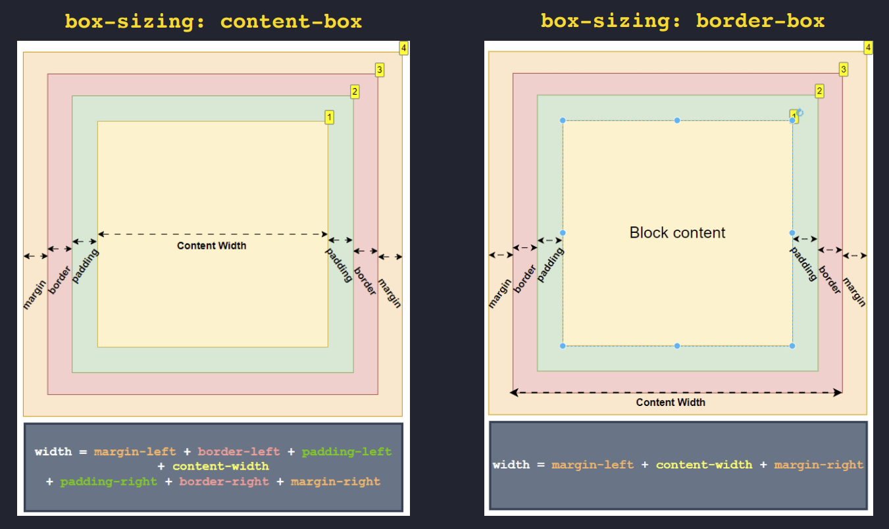
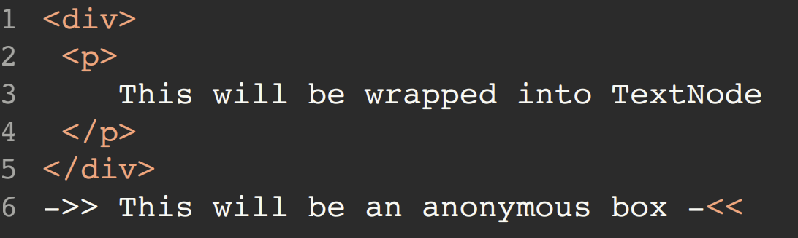

# 1 - Core Fundamentals

## 1.1 - Box Model

`Every HTML element is rendered as a box`, so, layout on the web is built by composing rectangles. Each box has `internal layers and behavior` that define how it occupies space. You are either controlling the content size or the final box size.

### 1.1.1 - Box Model Structure

#### Layers

- Content: defines the core area.
- Padding: expands internal spacing.
- Border: wraps content and padding.
- Margin: creates external spacing between elements.

#### Box Size

Intrinsic size:

- Determined by content.
- Default behavior.

Restricted size:

- Defined via CSS properties like width and height.
- Can also be constrained by parent dimensions.
- Responds to layout changes (like a shrinking parent).

[Codepen Snippet](https://codepen.io/RayEuji/pen/NWJZLzO)

Box-sizing behavior examples:

```css
/* CONTENT-BOX (default) */

.content-box {
  box-sizing: content-box;

  width: 100px; /* content width */
  padding: 10px; /* left + right = 20px */
  border: 5px solid; /* left + right = 10px */
}

/*
Total rendered width:

= content width
+ padding-left + padding-right
+ border-left + border-right

= 100
+ 10 + 10
+ 5 + 5

= 130px
*/
```

```css
/* BORDER-BOX (recommended) */
.border-box {
  box-sizing: border-box;

  width: 100px; /* total width */
  padding: 10px;
  border: 5px solid;
}

/*
Total rendered width:

= 100px

Because:
content width is reduced internally:

content = 100 - padding - border
= 100 - 20 - 10
= 70px
*/
```



#### Box Behavior

Defines how the box participates in layout flow.

| Behavior           | Block-level                    | Inline                          |
| ------------------ | ------------------------------ | ------------------------------- |
| Flow               | Top → bottom                   | Left → right (like text)        |
| Width              | Fills parent width             | Based on content                |
| Height             | Based on content               | Controlled by line-height       |
| Layout Context     | Block Formatting Context (BFC) | Inline Formatting Context (IFC) |
| Wrapping           | Creates new line               | Wraps across lines              |
| Width / Height CSS | Respected                      | Ignored                         |
| Vertical Margin    | Applied                        | Ignored                         |
| Vertical Padding   | Affects layout                 | Does not affect layout height   |
| Overflow Height    | Expands box                    | Ignored (non-context height)    |

[Codepen Snippet](https://codepen.io/RayEuji/embed/yLwdQRj)

#### Anonymous Boxes

The browser sometimes creates implicit boxes. To maintain valid layout structure especially when mixing inline and block content.

Example:

Text not wrapped in a block → browser wraps it in an anonymous block box.



So, the browser normalizes structure to preserve layout rules.
