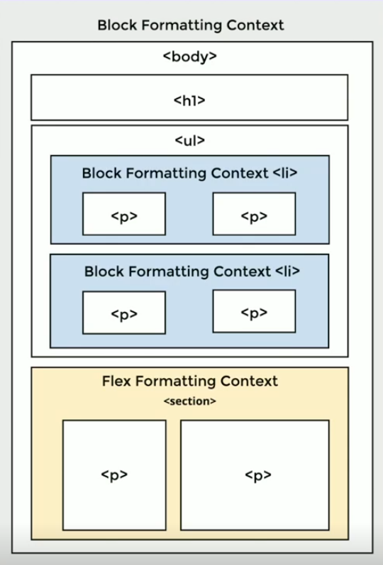

# 1 - Core Fundamentals

## 1.1 - Box Model

`Every HTML element is rendered as a box`, so, layout on the web is built by composing rectangles. Each box has `internal layers and behavior` that define how it occupies space. You are either controlling the content size or the final box size.

### 1.1.1 - Box Model Structure

#### Layers

- Content: defines the core area.
- Padding: expands internal spacing.
- Border: wraps content and padding.
- Margin: creates external spacing between elements.

#### Box Size

Intrinsic size:

- Determined by content.
- Default behavior.

Restricted size:

- Defined via CSS properties like width and height.
- Can also be constrained by parent dimensions.
- Responds to layout changes (like a shrinking parent).

[Codepen Snippet](https://codepen.io/RayEuji/pen/NWJZLzO)

Box-sizing behavior examples:

```css
/* CONTENT-BOX (default) */

.content-box {
  box-sizing: content-box;

  width: 100px; /* content width */
  padding: 10px; /* left + right = 20px */
  border: 5px solid; /* left + right = 10px */
}

/*
Total rendered width:

= content width
+ padding-left + padding-right
+ border-left + border-right

= 100
+ 10 + 10
+ 5 + 5

= 130px
*/
```

```css
/* BORDER-BOX (recommended) */
.border-box {
  box-sizing: border-box;

  width: 100px; /* total width */
  padding: 10px;
  border: 5px solid;
}

/*
Total rendered width:

= 100px

Because:
content width is reduced internally:

content = 100 - padding - border
= 100 - 20 - 10
= 70px
*/
```


#### Box Behavior

Defines how the box participates in layout flow.

| Behavior           | Block-level                    | Inline                          |
| ------------------ | ------------------------------ | ------------------------------- |
| Flow               | Top → bottom                   | Left → right (like text)        |
| Width              | Fills parent width             | Based on content                |
| Height             | Based on content               | Controlled by line-height       |
| Layout Context     | Block Formatting Context (BFC) | Inline Formatting Context (IFC) |
| Wrapping           | Creates new line               | Wraps across lines              |
| Width / Height CSS | Respected                      | Ignored                         |
| Vertical Margin    | Applied                        | Ignored                         |
| Vertical Padding   | Affects layout                 | Does not affect layout height   |
| Overflow Height    | Expands box                    | Ignored (non-context height)    |

[Codepen Snippet](https://codepen.io/RayEuji/embed/yLwdQRj)

#### Anonymous Boxes

The browser sometimes creates implicit boxes. To maintain valid layout structure especially when mixing inline and block content.

Example:

Text not wrapped in a block → browser wraps it in an anonymous block box.


So, the browser normalizes structure to preserve layout rules.

## 1.2 - Browser Formatting Contexts

A formatting context is a `rendering “environment” where elements follow a specific set of layout rules`. Once inside, elements behave predictably according to that context.

Think of it as a local coordinate system: elements don’t just exist globally, they are laid out based on the rules of the context they currently belong to.

### 1.2.1 - Core Idea

A formatting context defines:

- How elements are positioned
- How they consume space
- How they interact with siblings

Examples of rules:

- Block context → top-to-bottom, full-width by default
- Inline context → left-to-right, width based on content

### 1.2.2 - Isolation

> Each formatting context is `isolated` from others.

- Rules inside a context do not leak out
- External layout rules do not affect internal elements

Cause → effect:

- Creating a new context → creates a boundary
- Elements inside → only follow that context’s rules

```html
<div class="outer">
  <div class="inner">
    <div class="child"></div>
  </div>
</div>
```

If .inner creates a new formatting context:

- .child is laid out only based on .inner
- .outer rules no longer directly affect .child

### 1.2.3 - Nested Contexts

Formatting contexts can be nested.

- A parent context can contain multiple child contexts
- Each child context behaves independently

Key idea:

- Entering a new context = switching layout rules



### 1.2.4 - Common Types

#### Block Formatting Context (BFC)

Default for most elements.

Behavior:

- Elements stack vertically (top → bottom)
- Elements expand to fill available width
- Width defaults to 100% of parent

#### Inline Formatting Context (IFC)

Created by inline content (e.g. span, text).

Behavior:

- Elements flow left → right
- Width is based on content
- Multiple elements can sit on the same line
- Rendered in a row like text

#### Flex Formatting Context

Created with:

```css
.container {
  display: flex;
}
```

Behavior:

- Children become flex items
- Layout follows flex rules (axis, alignment, distribution)

#### Grid Formatting Context

Created with:

```css
.container {
  display: grid;
}
```

Behavior:

- Children are placed into a 2D grid system

### 1.2.5 - Creating a New Formatting Context

A new context is created when:

- The browser default applies (e.g. root element)
- Or explicitly via CSS

Common triggers:

```css
display: block;
display: inline-block;
display: flex;
display: grid;
```

Important detail:

- inline-block creates a block formatting context internally
- There is no separate “inline-block context”

### 1.2.6 - Browser Rendering Flow

> The browser builds formatting contexts incrementally while parsing HTML.

Step-by-step mental model:

1. Start with html
   - Creates the initial block formatting context

2. body, headings, lists
   - Enter the existing context (no new one created)

3. Element with explicit display
   - Creates a new formatting context

Example:

```html
<li style="display: inline-block"></li>
```

→ New formatting context created
→ Children follow that context’s rules

4. Flex container

```css
section {
  display: flex;
}
```

→ New flex formatting context
→ All children become flex items

5. Inline elements inside

```html
<span>Text</span>
```

→ Creates an inline formatting context
→ Content flows as inline text

### 1.2.7 - Why Formatting Contexts Exist

They provide:

- `Isolation`
  → prevents layout interference

- `Predictability`
  → consistent rules per context

- `Scalability`
  → new layout systems (flex, grid) are just new contexts

Design insight:

- Instead of adding random rules globally, `CSS introduces new contexts with well-defined behavior`.

### 1.2.8 - CSS vs HTML Responsibility

- HTML elements provide default behavior
- `CSS defines or overrides the formatting context`

Cause → effect:

- No CSS → default block/inline behavior
- With CSS (display) → context changes completely

```css
html {
  display: flex;
}
```

→ Even the root becomes a flex formatting context

Key takeaway:

- Formatting context is primarily controlled by CSS, not the tag itself
