# 5 - Application State & Network Connectivity

## 5.1 - Application State Design

Application state should be designed around how data is accessed, searched, updated, stored, and removed from memory.

### 5.1.1 - State Classification

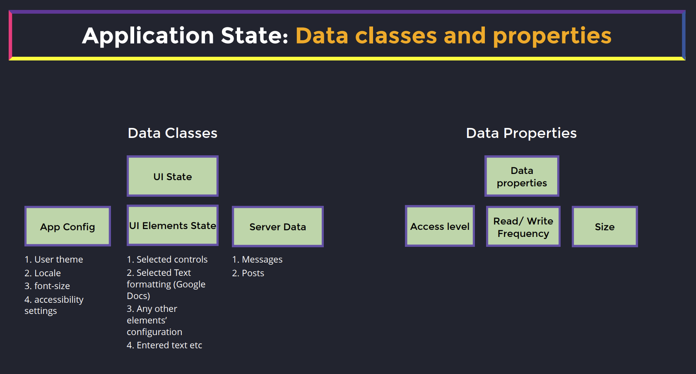

State can be classified by its role and by its runtime characteristics.

| Category          | Examples                                     |
| ----------------- | -------------------------------------------- |
| App configuration | Theme, locale, font size, accessibility      |
| UI state          | Selected controls, open panels, entered text |
| Server data       | Users, posts, messages, conversations        |

| Property             | Main question                                    |
| -------------------- | ------------------------------------------------ |
| Access scope         | Is the data local or global?                     |
| Read/write frequency | How often is it accessed or changed?             |
| Size                 | Can it remain in memory safely?                  |
| Lifetime             | Is it temporary, session-based, or persistent?   |
| Search needs         | Is lookup by ID enough, or is indexing required? |

These properties determine both the state structure and the storage mechanism.

### 5.1.2 - Main Design Goals

A good state structure minimizes three costs:

| Goal                    | Preferred approach                      |
| ----------------------- | --------------------------------------- |
| Fast direct access      | Store entities by ID                    |
| Fast search             | Add indexes when needed                 |
| Controlled memory usage | Keep only active data in runtime memory |

Direct access by ID is usually faster than scanning an array.

```ts
const message = state.messagesById[messageId];
```

This is preferable to:

```ts
const message = messages.find((message) => message.id === messageId);
```

### 5.1.3 - Data Normalization

Normalization stores each entity once and uses IDs to represent relationships.

#### 5.1.3.1 - First Normal Form

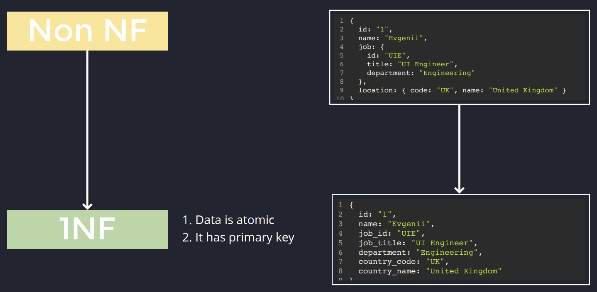

For UI state, the practical rules are:

- each entity has a stable primary key
- nested independent entities are replaced by atomic fields or IDs
- deeply nested reusable data is avoided

Example:

```ts
type User = {
  id: string;
  name: string;
  jobId: string;
  countryCode: string;
};
```

#### 5.1.3.2 - Second Normal Form

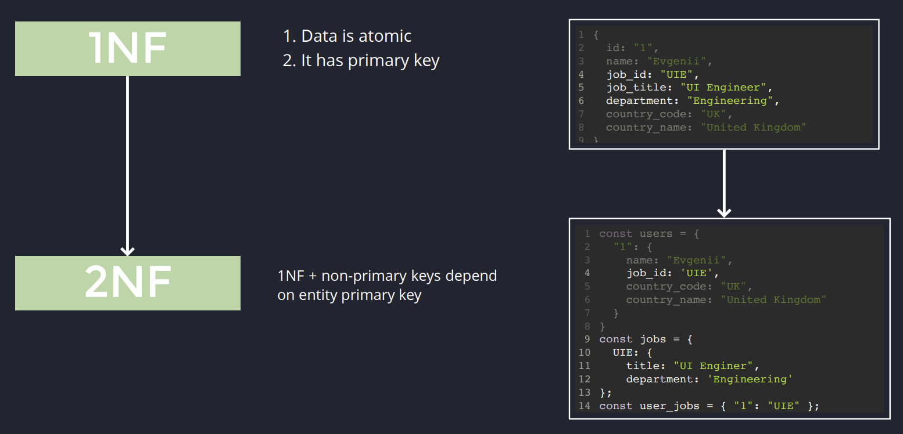

Data that belongs to another entity is moved to its own collection.

```ts
type User = {
  id: string;
  name: string;
  jobId: string;
};

type Job = {
  id: string;
  title: string;
  department: string;
};
```

This avoids duplicating job data across multiple users.

#### 5.1.3.3 - Third Normal Form

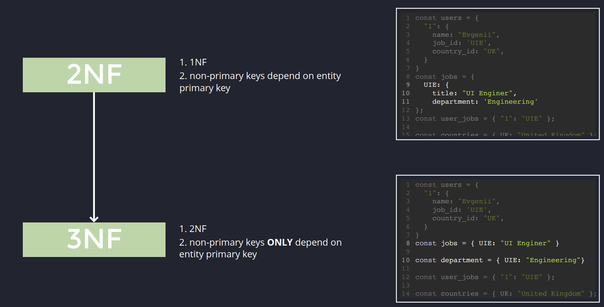

Fields that belong to a separate entity are extracted again.

```ts
type Job = {
  id: string;
  title: string;
  departmentId: string;
};

type Department = {
  id: string;
  name: string;
};
```

In UI applications, this level is useful only when the extra separation improves reuse, consistency, or access.

#### 5.1.3.4 - Messenger Example

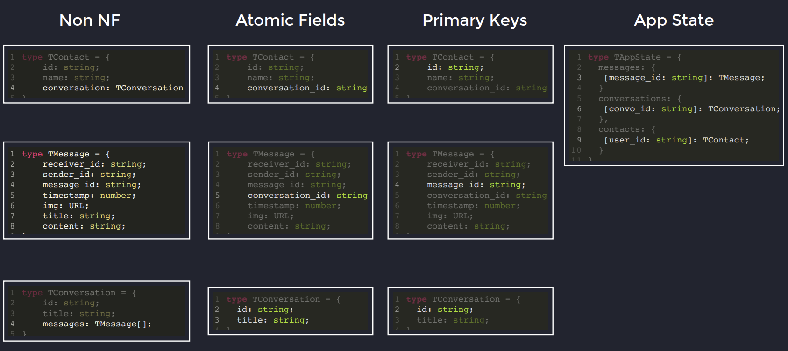

The normalization flow is:

1. Remove nested conversations and messages.
2. Replace nested relationships with IDs.
3. Define a primary key for each entity.
4. Store entities in separate keyed collections.

```ts
type AppState = {
  contacts: Record<string, Contact>;
  conversations: Record<string, Conversation>;
  messages: Record<string, Message>;
};
```

Result:

```ts
const message = state.messages[messageId];
```

The entity can now be accessed directly without scanning nested arrays.

### 5.1.4 - Relationship and Search Indexes

Normalization improves lookup by ID, but relationships and text search may still require extra indexes.

For conversation relationships:

```ts
type AppState = {
  messagesById: Record<string, Message>;
  messageIdsByConversationId: Record<string, string[]>;
};
```

This separates two concerns:

| Structure                  | Purpose                             |
| -------------------------- | ----------------------------------- |
| messagesById               | Find one message by ID              |
| messageIdsByConversationId | Find all messages in a conversation |

### 5.1.5 - Inverted Indexes

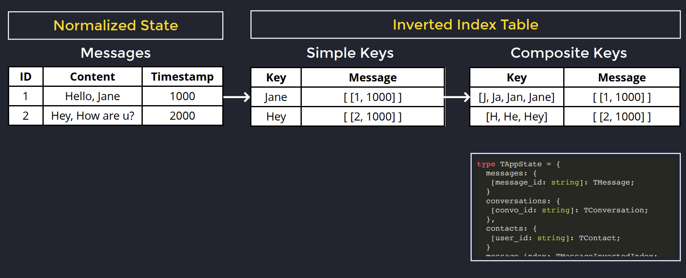

An inverted index maps searchable content to entity IDs.

```txt
word or prefix → message IDs
```

Exact-word index:

```ts
const messageIndex = {
  jane: ["1"],
  hey: ["2"],
};
```

Prefix index:

```ts
const prefixIndex = {
  j: ["1"],
  ja: ["1"],
  jan: ["1"],
  jane: ["1"],
};
```

| Benefit            | Cost                   |
| ------------------ | ---------------------- |
| Faster search      | More storage           |
| Prefix matching    | More indexing work     |
| No full array scan | More update complexity |

Large indexes should be built incrementally, in a Web Worker, or during idle time.

### 5.1.6 - Runtime Memory and Persistence

Runtime state should contain the active working set, not every record the application has ever loaded.

```txt
active data → runtime state
inactive data → persistent storage
```

For a messaging app:

- active conversation stays in memory
- inactive conversations move out of runtime state
- persisted data remains in IndexedDB
- selecting a conversation loads it back into memory

Data can be garbage-collected only after all active references are removed.

### 5.1.7 - Browser Storage

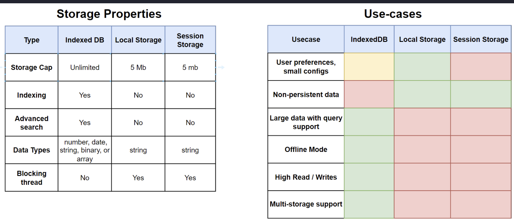

| Property             | IndexedDB         | localStorage | sessionStorage      |
| -------------------- | ----------------- | ------------ | ------------------- |
| API                  | Asynchronous      | Synchronous  | Synchronous         |
| Data format          | Structured values | Strings      | Strings             |
| Persistence          | Persistent        | Persistent   | Current tab session |
| Indexes              | Yes               | No           | No                  |
| Suitable size        | Medium to large   | Small        | Small               |
| Main-thread blocking | Low at API level  | Yes          | Yes                 |

Important notes:

- IndexedDB is not literally unlimited; browser quota rules apply.
- localStorage and sessionStorage can block the main thread.
- large IndexedDB results can still use significant CPU and memory after loading.

### 5.1.8 - Storage Selection

| Use case                    | Recommended option |
| --------------------------- | ------------------ |
| Active UI data              | Runtime state      |
| Theme and preferences       | localStorage       |
| Temporary per-tab data      | sessionStorage     |
| Large structured data       | IndexedDB          |
| Offline data                | IndexedDB          |
| Indexed search              | IndexedDB          |
| Frequent large reads/writes | IndexedDB          |

A practical design flow is:

```txt
classify data
→ evaluate size, frequency, and lifetime
→ normalize reusable entities
→ add relationship indexes
→ add search indexes only when needed
→ keep active data in memory
→ persist inactive or large data
```

## 5.2 - Network Connectivity

Network connectivity design depends on reliability, latency, connection lifetime, bandwidth, and device constraints.

### 5.2.1 - Latency and Reconnection

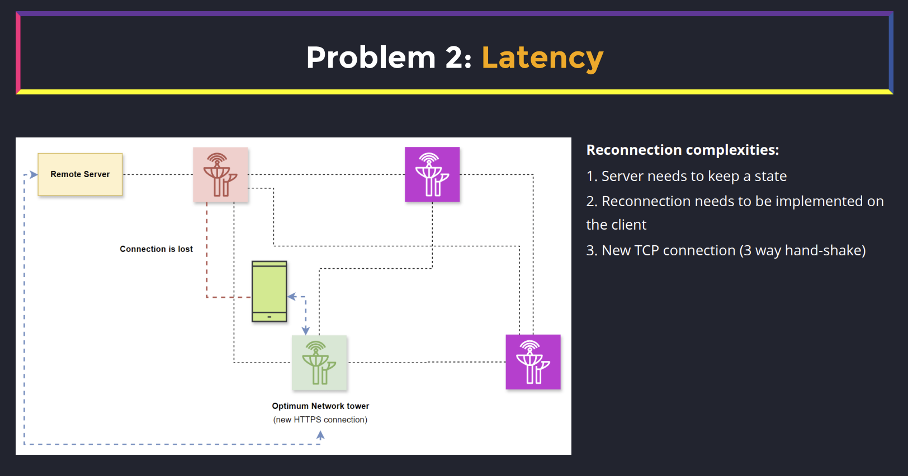

Mobile clients may lose connectivity when moving between network towers or switching networks.

A reconnection may require:

1. detecting the lost connection
2. selecting a new network route
3. establishing a new transport connection
4. restoring application state
5. retrying pending operations

| Responsibility | Typical behavior                                       |
| -------------- | ------------------------------------------------------ |
| Client         | Detects failures, retries, and restores subscriptions  |
| Server         | Keeps enough state to resume the session when required |
| Transport      | Establishes a new connection before data can continue  |

A new TCP connection adds latency because the client and server must complete a handshake before exchanging application data.

### 5.2.2 - UDP and TCP

.png>)

UDP and TCP provide different transport guarantees.

| Property           | UDP                         | TCP                         |
| ------------------ | --------------------------- | --------------------------- |
| Connection setup   | No handshake                | Three-way handshake         |
| Delivery guarantee | No                          | Yes                         |
| Ordering guarantee | No                          | Yes                         |
| Retransmission     | Application responsibility  | Built into the protocol     |
| Overhead           | Lower                       | Higher                      |
| Typical use        | Real-time media, games, DNS | HTTP/1.1, HTTP/2, WebSocket |

TCP begins with a three-way handshake:

```txt
client → SYN → server
client ← SYN-ACK ← server
client → ACK → server
```

After the connection is established, application data can be exchanged.

UDP avoids this setup cost, but the application must tolerate or handle missing and out-of-order packets.

### 5.2.3 - Protocol Stack

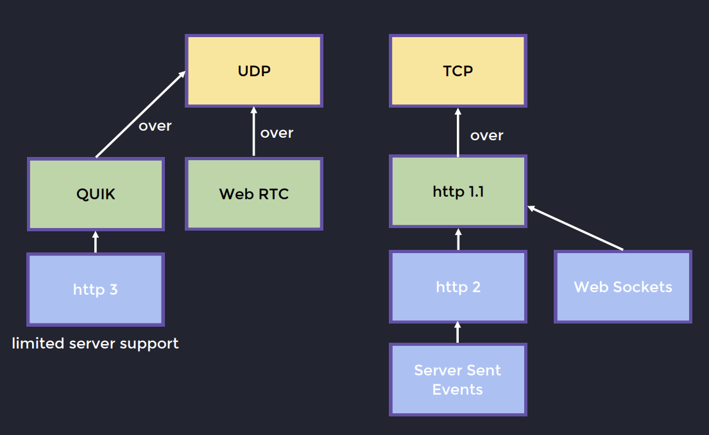

Web protocols are built on top of transport protocols.

| Protocol           | Transport     | Main use                               |
| ------------------ | ------------- | -------------------------------------- |
| HTTP/1.1           | TCP           | Request-response communication         |
| HTTP/2             | TCP           | Multiplexed HTTP requests              |
| WebSocket          | Usually TCP   | Bidirectional persistent communication |
| Server-Sent Events | HTTP over TCP | Server-to-client event stream          |
| HTTP/3             | QUIC over UDP | Multiplexed HTTP with faster recovery  |
| WebRTC             | Usually UDP   | Real-time audio, video, and peer data  |

Important notes:

- HTTP/3 runs over QUIC, not directly over raw UDP.
- WebSocket starts with an HTTP handshake and then keeps a persistent bidirectional connection.
- Server-Sent Events works over HTTP and is not limited to HTTP/2.
- WebRTC prefers UDP but may fall back to other transports when necessary.

### 5.2.4 - Polling

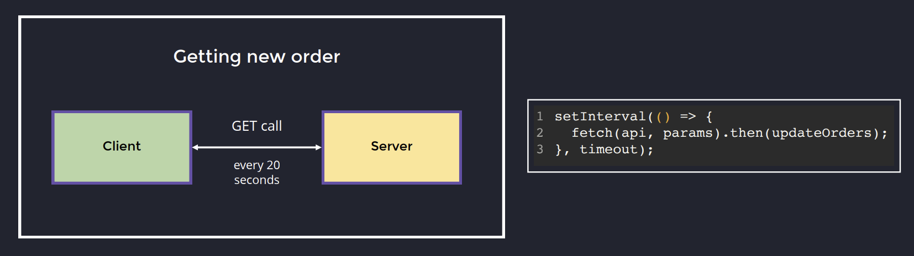

Polling repeatedly asks the server whether new data is available.

```ts
const intervalId = window.setInterval(async () => {
  const response = await fetch("/api/orders");
  const orders = await response.json();

  updateOrders(orders);
}, 20_000);
```

Polling is simple, but `data is only discovered on the next request`.

```txt
poll interval = 20 seconds
worst-case update delay ≈ 20 seconds
average update delay ≈ 10 seconds
```

| Advantage                        | Limitation                           |
| -------------------------------- | ------------------------------------ |
| Simple implementation            | Delayed updates                      |
| Works with normal HTTP endpoints | Repeated requests with no new data   |
| Easy server architecture         | Extra headers and network activity   |
| Easy to debug                    | More battery usage on mobile devices |

HTTP connections may be reused through keep-alive, so polling does not always create a new TCP connection for every request. Connection loss or timeout can still force a new handshake.

### 5.2.5 - Mobile Network and Energy Cost

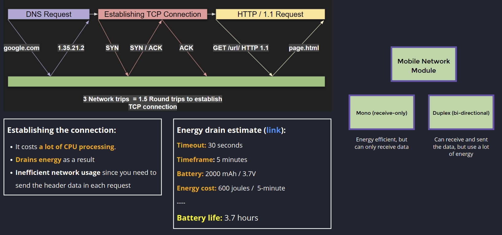

Network activity affects mobile devices more than desktop devices.

Repeated polling can cause:

- periodic CPU work
- radio wake-ups
- repeated request headers
- extra bandwidth usage
- increased battery consumption
- reconnection work after network changes

Mobile radios use more energy while actively sending and receiving data than while waiting in a low-power state.

| Mode                                | Behavior                           | Energy use |
| ----------------------------------- | ---------------------------------- | ---------- |
| Low-power or receive-oriented state | Mostly waits for incoming activity | Lower      |
| Active bidirectional state          | Sends and receives data            | Higher     |

The exact battery cost depends on the device, network, signal quality, request frequency, and operating system. A fixed battery-life estimate should not be treated as universal.

### 5.2.6 - When Polling Is Appropriate

Polling is suitable when:

- updates are infrequent
- a small delay is acceptable
- implementation simplicity is more important than real-time delivery
- the application mainly targets stable desktop connections

Polling is less suitable when:

- the client requires immediate updates
- requests frequently return no new data
- users are on mobile networks
- battery and bandwidth are important
- the connection frequently changes

| Requirement                                   | Better starting point |
| --------------------------------------------- | --------------------- |
| Occasional updates                            | Polling               |
| Server-to-client updates                      | Server-Sent Events    |
| Bidirectional real-time messages              | WebSocket             |
| Real-time media or peer communication         | WebRTC                |
| Modern HTTP with improved connection recovery | HTTP/3                |

## 5.3 - Server-Sent Events

Server-Sent Events (SSE) `keep a persistent HTTP connection open so the server can continuously send updates` to the client.

### 5.3.1 - Characteristics and Use Cases

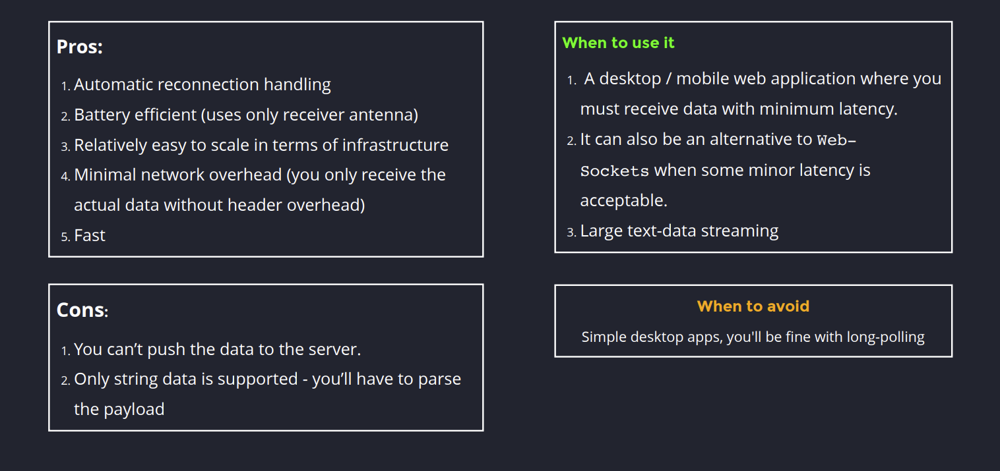

SSE provides one-way communication:

```txt
server → client
```

The client opens the connection with EventSource, and the server responds with a stream using the text/event-stream content type.

| Property                  | Behavior                        |
| ------------------------- | ------------------------------- |
| Direction                 | Server to client                |
| Connection                | Persistent HTTP connection      |
| Payload                   | Text-based events               |
| Reconnection              | Built into EventSource          |
| Ordering                  | Events arrive in stream order   |
| Client-to-server messages | Require a separate HTTP request |

SSE is a good fit for:

- notifications
- order status updates
- dashboards
- logs
- progress updates
- text-based streams

It is `not suitable when both sides need frequent real-time communication`. In that case, WebSocket is usually a better fit.

### 5.3.2 - Client Example

```ts
const events = new EventSource("/api/orders/stream");

events.onmessage = (event) => {
  const order = JSON.parse(event.data);
  updateOrder(order);
};

events.onerror = () => {
  // EventSource retries automatically unless the connection is closed.
};
```

The server sends events in this format:

```txt
id: 42
event: order-created
data: {"id":"42","status":"created"}

```

| Field | Purpose                              |
| ----- | ------------------------------------ |
| data  | Event payload                        |
| event | Custom event name                    |
| id    | Identifier used to resume the stream |
| retry | Suggested reconnection delay         |

Custom event types can be handled separately:

```ts
events.addEventListener("order-created", (event) => {
  const order = JSON.parse(event.data);
  addOrder(order);
});
```

### 5.3.3 - Reconnection and Scaling

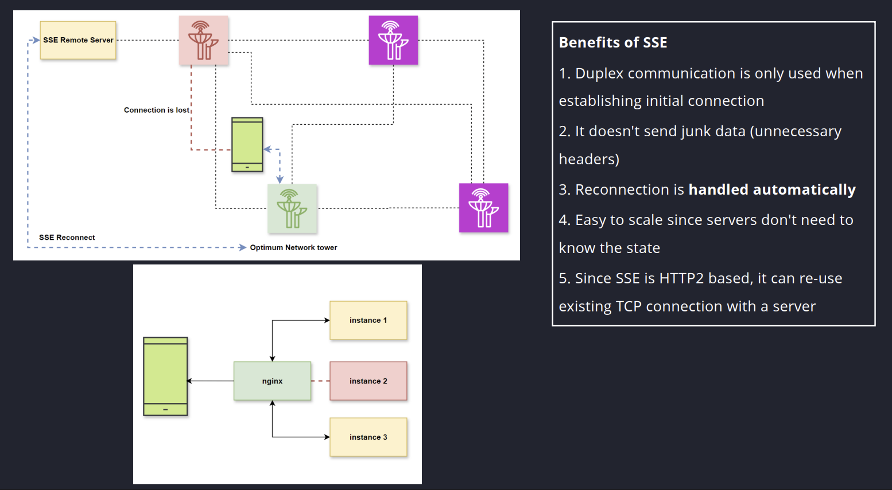

When the connection is interrupted, EventSource automatically tries to reconnect.

If the server provides event IDs, the browser can send the last processed ID in the Last-Event-ID header. The server may then continue from the next event instead of restarting the stream.

```txt
connection lost
→ browser reconnects
→ Last-Event-ID is sent
→ server resumes the stream
```

Automatic reconnection is handled by the client API, but resumability still requires server support.

| Requirement               | Server responsibility                          |
| ------------------------- | ---------------------------------------------- |
| Resume after reconnect    | Store or recover events by ID                  |
| Multiple server instances | Share event state or use a message broker      |
| Load balancing            | Avoid losing stream position between instances |
| Duplicate prevention      | Treat event IDs as idempotency references      |

SSE does not automatically make servers stateless. Horizontal scaling usually requires shared infrastructure such as:

- Redis Pub/Sub
- Kafka
- a message queue
- a shared event store

### 5.3.4 - Network and Performance

SSE avoids repeated polling requests because data is sent only when an event is available.

| Polling                            | SSE                                     |
| ---------------------------------- | --------------------------------------- |
| Client repeatedly requests updates | Server pushes updates                   |
| Repeated request headers           | One long-lived response                 |
| Update delay depends on interval   | Events arrive shortly after publication |
| Frequent empty responses possible  | No response when no event exists        |
| Reconnection implemented manually  | EventSource retries automatically       |

SSE works over HTTP/1.1, HTTP/2, and HTTP/3. It is not inherently limited to HTTP/2.

Under HTTP/2 or HTTP/3, multiple streams can share one connection, reducing connection overhead compared with separate HTTP/1.1 connections.

### 5.3.5 - Limitations

SSE has a few important constraints:

- communication is one-way
- payloads are UTF-8 text
- binary data must be encoded or fetched separately
- long-lived connections consume server resources
- browser connection limits may matter under HTTP/1.1
- authentication and proxy timeouts need explicit handling

JSON is commonly sent as text:

```ts
const payload = JSON.parse(event.data);
```

The connection should be closed when it is no longer needed:

```ts
events.close();
```

### 5.3.6 - When to Use SSE

| Requirement                              | Recommended choice |
| ---------------------------------------- | ------------------ |
| Occasional updates with acceptable delay | Polling            |
| Continuous server-to-client updates      | SSE                |
| Bidirectional real-time communication    | WebSocket          |
| Audio, video, or peer-to-peer data       | WebRTC             |

Choose SSE when:

- updates originate mainly from the server
- low latency is useful
- automatic reconnection is desired
- text-based events are sufficient
- full bidirectional communication is unnecessary