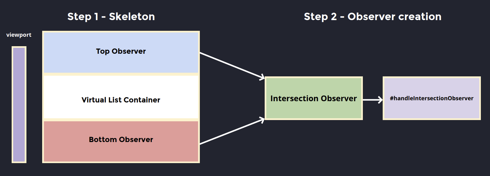
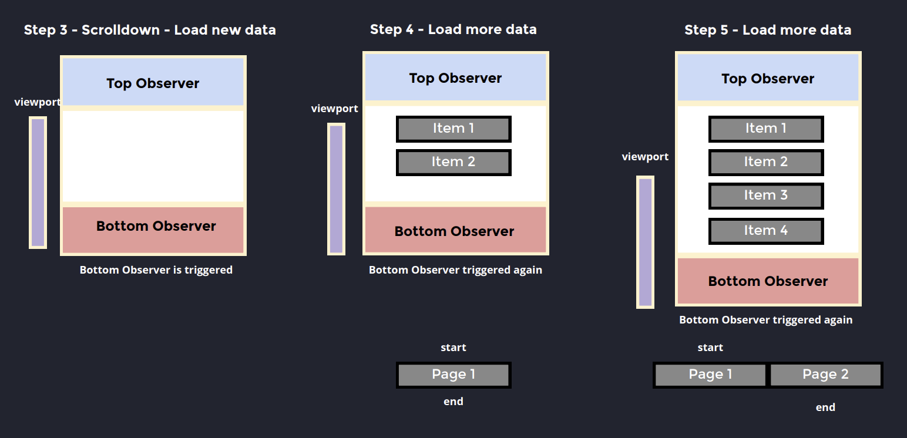
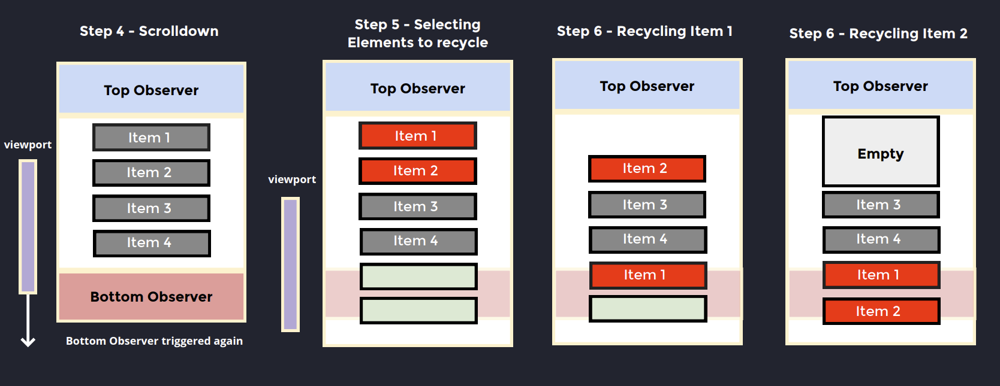
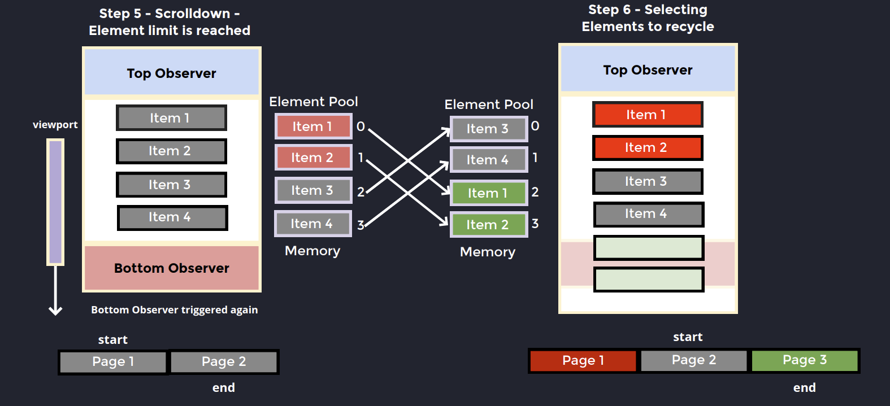
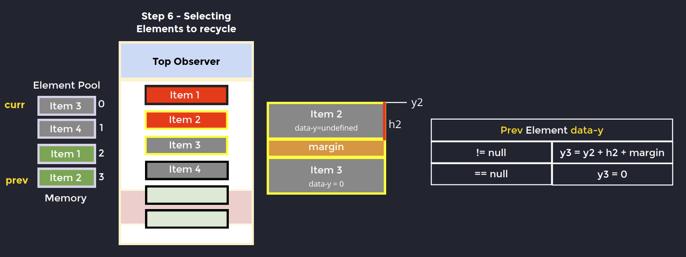
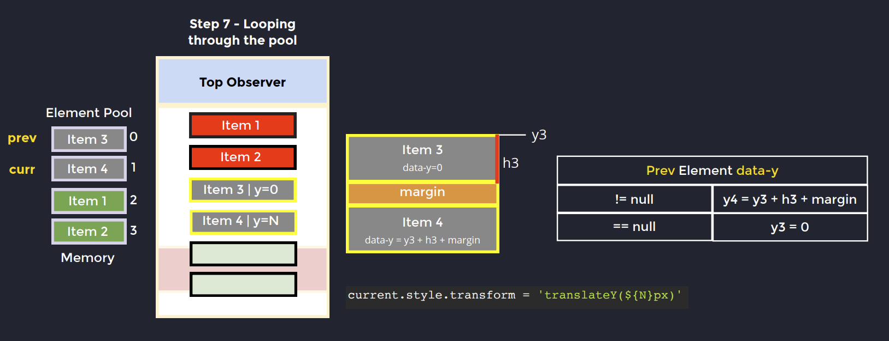
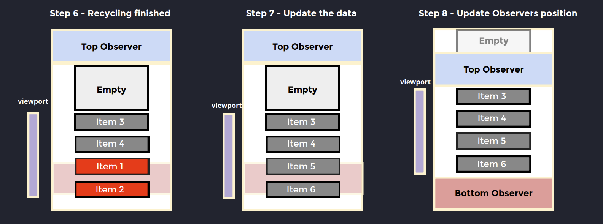

# 4 - Virtualization

A rendering optimization technique that `keeps a limited window of data in memory while rendering only the visible items` plus a small buffer around them.

The main goal is to `reduce DOM size, mutations, CPU work, and memory` usage. Large DOM trees are expensive for the browser to maintain, layout, paint, and update.

## 4.1 - Core Idea

Instead of rendering the entire dataset:

- keep a limited window of data in memory
- render a fixed pool of DOM nodes
- recycle DOM nodes as the user scrolls

Mental model:

- the data grows
- the DOM stays almost the same size

Cause → effect:

- fewer DOM nodes → less layout/repaint work
- fewer mutations → lower CPU usage
- stable DOM size → more predictable performance

| Aspect                | Normal Rendering             | Virtualization          |
| --------------------- | ---------------------------- | ----------------------- |
| DOM size              | grows continuously           | stays relatively stable |
| CPU work              | more layout/repaint work     | reduced rendering work  |
| Scrolling performance | degrades with large lists    | more consistent         |
| Element lifecycle     | constantly creates new nodes | reuses existing nodes   |

This is especially important for:

- infinite feeds
- chat applications
- tables
- large lists
- log viewers

### Structure

A virtualized list usually contains:

- top observer
- viewport
- virtual list container
- bottom observer

Simplified structure:

```html
<div class="container">
  <div id="top-observer"></div>

  <div class="virtual-list">
    <!-- rendered items -->
  </div>

  <div id="bottom-observer"></div>
</div>
```



| Element         | Responsibility             |
| --------------- | -------------------------- |
| top observer    | detects upward scrolling   |
| viewport        | defines the visible area   |
| virtual list    | renders visible items      |
| bottom observer | detects downward scrolling |

The observers are typically implemented with IntersectionObserver.

### Loading new Data

The list maintains a sliding window using:

- start: points to the first page currently represented by the rendered window.
- end: points to the latest page currently represented by the rendered window.

When scrolling down, end advances to fetch the next page. Once recycling starts, start also advances because the oldest page is removed from the virtual window.

When scrolling up, the list fetches the page before start and moves the window backward.

Example flow:



Each bottom-observer intersection loads the next page.

Before the element limit is reached, the rendered window expands by appending new nodes. After the limit is reached, the list recycles existing nodes instead.

### Virtual list inputs

The implementation receives a few generic functions and configuration values:

- getPage(pointer): fetches one page of data.
- getTemplate(data): creates a new DOM element while the pool is still growing.
- updateTemplate(data, element): updates an existing DOM element during recycling.
- pageSize: defines how many items are returned per page.

This makes the virtual list reusable with different data sources and card templates.

## 4.2 - Recycling

Recycling is the process of `reusing existing DOM elements instead of creating new ones when the list reaches its limit`.

At first, the virtual list renders normally. As the user scrolls down and the bottom observer is triggered, new items are appended until the pool reaches its maximum size.

Once the limit is reached, the list no longer creates additional cards. Instead, it `reuses cards that are no longer visible above the viewport`.

The element pool stores references to reusable DOM elements, not just data.

For example, when `pageSize = 10`, the implementation keeps at most two pages in the pool:

```txt
limit = pageSize * 2
limit = 20 DOM nodes
```

Once the pool reaches this limit, newly fetched data is rendered by updating existing nodes instead of creating new ones.

### Recycling flow when scrolling down (bottom observer)

The user scrolls down until the `bottom observer` intersects with the viewport.



Since the element limit has already been reached, the next page cannot be rendered by creating new DOM nodes.

---

### Reach the element limit and reorder the pool

The first half of the pool contains items that are now outside the viewport, so those elements can be safely reused.



```txt
recycle:   [Item 1, Item 2]
unchanged: [Item 3, Item 4]
```

The element pool is then reordered in memory so that the unchanged elements come first and the recyclable elements move to the end.

```txt
Before:
[Item 1, Item 2, Item 3, Item 4]

After:
[Item 3, Item 4, Item 1, Item 2]
```

At this point, the DOM nodes have not been replaced. The pool order only changes logically in memory.

---

### Calculate new vertical positions

The list loops through the reordered pool and calculates the vertical position of every element.



Each card stores its calculated position in data-y.

If the previous element does not have a position yet, the current item starts at y = 0. Otherwise, its position is calculated from the previous card:

```ts
currentY = previousY + previousHeight + margin * 2;
```

This lets the list determine where every item should appear after recycling.

---

### Move elements with translateY

After calculating the new positions, the list loops through the pool and applies those positions visually.



```ts
current.style.transform = `translateY(${currentY}px)`;
```

The `cards are absolutely positioned, so they can be moved independently with transform`: translateY(...).

The recycled nodes are moved from the top of the list to the bottom. No additional DOM nodes are created.

The temporary logical order is:

```txt
Item 3
Item 4
Item 1
Item 2
```

Item 1 and Item 2 still refer to the same DOM nodes; they are simply being reused in new positions.

---

### Update recycled content and observer positions

The recycled nodes receive the newly fetched data.



```txt
Item 1 node → displays Item 5
Item 2 node → displays Item 6
```

The rendered sequence becomes:

```txt
Item 3
Item 4
Item 5
Item 6
```

Finally, both observers are moved to match the new boundaries of the rendered window:

- The top observer is placed before Item 3.
- The bottom observer is placed after Item 6.

This prepares the virtualized list for the next upward or downward scroll event.

---

### Reference Table

| Step                          | Slide label(s)                                                                                    | Description                                                                                                                 | Result                                                                                                        |
| ----------------------------- | ------------------------------------------------------------------------------------------------- | --------------------------------------------------------------------------------------------------------------------------- | ------------------------------------------------------------------------------------------------------------- |
| 1. Render the initial window  | Before the shown slides                                                                           | The list renders the first pages normally while the pool is still below its limit.                                          | New DOM nodes are created and added to the element pool.                                                      |
| 2. Scroll down                | **Step 4 – Scrolldown**                                                                           | The user scrolls until the **bottom observer** enters the viewport again.                                                   | The list needs to load the next page of data.                                                                 |
| 3. Reach the element limit    | **Step 5 – Scrolldown – Element limit is reached**                                                | The pool already contains the maximum allowed number of elements, so the list can no longer append more cards.              | Recycling is required instead of creating new DOM nodes.                                                      |
| 4. Select recyclable elements | **Step 5 – Selecting Elements to recycle** / **Step 6 – Selecting Elements to recycle**           | The first half of the pool contains items that are now above the viewport and can be reused.                                | `Item 1` and `Item 2` are selected for recycling.                                                             |
| 5. Reorder the element pool   | Shown in the element pool diagram                                                                 | The unchanged elements move to the beginning of the pool, while recyclable elements move to the end.                        | The logical order changes from `[Item 1, Item 2, Item 3, Item 4]` to `[Item 3, Item 4, Item 1, Item 2]`.      |
| 6. Calculate new positions    | **Step 6 – Selecting Elements to recycle** / **Step 7 – Looping through the pool**                | The list loops through the reordered pool and calculates a new vertical `data-y` position for each card.                    | The first item starts at `y = 0`; every following item uses the previous card’s position, height, and margin. |
| 7. Move elements              | **Step 6 – Recycling Item 1**, **Step 6 – Recycling Item 2**, and **Step 6 – Recycling finished** | The list applies the calculated `translateY(...)` positions to the pool. The recycled cards move below the unchanged cards. | The visual order becomes `Item 3`, `Item 4`, `Item 1`, `Item 2`, using the same DOM nodes.                    |
| 8. Update recycled content    | **Step 7 – Update the data**                                                                      | The recycled nodes receive the next page of data.                                                                           | The old `Item 1` node becomes `Item 5`, and the old `Item 2` node becomes `Item 6`.                           |
| 9. Reposition observers       | **Step 8 – Update Observers position**                                                            | The observers are moved to the new boundaries of the rendered window.                                                       | The top observer goes before `Item 3`, and the bottom observer goes after `Item 6`.                           |
| 10. Preserve scrollable space | Mentioned later in the implementation                                                             | The container height is updated using its `scrollHeight`.                                                                   | The scrollbar does not shrink when items are recycled and moved upward or downward.                           |

[Gradual steps gallery](https://postimg.cc/gallery/s13VLNz)

## 4.3 - Virtualization in React

In React, virtualization is usually `implemented declaratively through libraries instead of manual DOM` recycling.

Common libraries:

- react-window
- react-virtualized
- TanStack Virtual

Instead of manually moving DOM nodes, React virtualization typically works by:

- calculating the visible range
- rendering only visible items
- updating the rendered subset during scroll

Example:

```ts
const startIndex = Math.floor(scrollTop / itemHeight);
const endIndex = startIndex + visibleCount;
```

Then only the visible slice is rendered:

```ts
items.slice(startIndex, endIndex);
```

| Vanilla JS                                    | React Virtualization              |
| --------------------------------------------- | --------------------------------- |
| manual DOM recycling                          | declarative rendering             |
| direct DOM mutations                          | state-driven updates              |
| explicit node movement                        | abstracted by libraries           |
| May use IntersectionObserver or scroll events | Usually abstracted by the library |
| low-level control                             | easier integration                |

Unlike low-level vanilla JS implementations:

- React usually abstracts DOM recycling
- libraries manage positioning internally
- rendering becomes state-driven instead of mutation-driven

Many React virtualization libraries also use:

- absolute positioning
- translateY
- spacer elements
- overscanning

Overscanning renders a small buffer outside the viewport to avoid visible pop-in during fast scrolling.

Example:

```txt
visible items: 10
overscan: 3
actual rendered: 16
```

Modern React virtualization often `relies more on scroll position calculations than IntersectionObserver because it provides more deterministic rendering behavior` for large lists.
